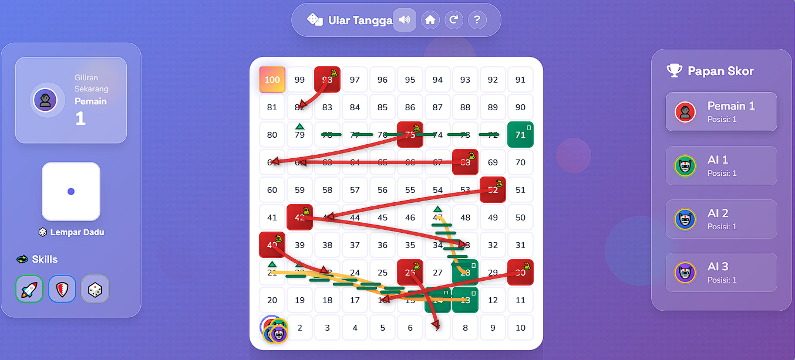

# Ular Tangga Modern 🎲
[](https://opensource.org/licenses/MIT)
[](#)
[](#)
[](#)

**Ular Tangga Modern** adalah implementasi web dari permainan papan klasik yang dirancang untuk pengalaman bermain yang cepat, visual yang menarik, dan interaktivitas modern—semuanya berjalan langsung di browser Anda tanpa perlu instalasi.

### Kenapa Ular Tangga Modern?
- **Ringan & Cepat**: Dibangun dengan Vanilla JavaScript (ES6+), HTML5, dan CSS3. Tidak ada framework, tidak ada bundler.
- **Fokus pada Gameplay**: Aturan klasik dengan sentuhan modern seperti mode permainan cepat dan skill acak.
- **Visual Menarik**: Antarmuka yang bersih, animasi yang halus, dan desain responsif untuk semua perangkat.

<!-- PLAY / HERO -->
<p align="center">
  <a href="https://fawwaz1st.github.io/ulartangga/" target="_blank" rel="noopener noreferrer">
    
  </a>
</p>

<p align="center">
  
  <br/>
  <em>Screenshot: Tampilan permainan dengan papan, pemain, dan panel kontrol.</em>
</p>

---

## Daftar Isi
- [Demo Langsung](#demo-langsung)
- [Fitur Utama](#fitur-utama)
- [Cara Bermain](#cara-bermain)
- [Struktur Proyek](#struktur-proyek)
- [Teknologi](#teknologi)
- [Roadmap](#roadmap)
- [Kontribusi](#kontribusi)
- [Lisensi](#lisensi)

---

## ✨ Demo Langsung
Mainkan gamenya langsung di browser Anda!
**[Klik di sini untuk bermain](https://fawwaz1st.github.io/ulartangga/)**

---

## 🚀 Fitur Utama
- **🎲 Papan Dinamis**: Papan 10x10 yang dibuat secara otomatis.
- **🐍 Ular & Tangga Acak**: Posisi ular dan tangga selalu berbeda di setiap permainan.
- **🤖 Lawan AI**: Bermain sendiri melawan komputer.
- **👥 Multiplayer Lokal**: Bermain bersama teman (hingga 4 pemain).
- **⚡ Mode Permainan**:
  - **Klasik**: Permainan santai dengan aturan standar.
  - **Cepat**: Permainan lebih cepat dengan bonus dan skill.
- **� Statistik**: Lacak kemenangan dan total permainan.
- **📱 Desain Responsif**: Tampilan optimal di desktop maupun mobile.
- **🎵 Efek Suara**: Efek suara untuk dadu, gerakan, dan lainnya.

---

## 🎮 Cara Bermain
1.  **Buka Game**: Akses **[demo langsung](https://fawwaz1st.github.io/ulartangga/)**.
2.  **Mulai Permainan**: Klik tombol "Mulai Permainan".
3.  **Atur Permainan**: Pilih jumlah pemain dan mode permainan.
4.  **Lempar Dadu**: Klik dadu untuk menggerakkan pion Anda.
5.  **Menang**: Jadilah pemain pertama yang mencapai kotak 100 untuk memenangkan permainan! 🏆

---

## 📂 Struktur Proyek
```
.
├── assets
│   ├── css/         # File-file styling (game, menu, loading)
│   ├── images/      # Gambar (favicon, screenshot)
│   └── js/          # Logika permainan (app, menu, audio, skills)
├── views
│   ├── game.html    # Halaman permainan utama
│   └── menu.html    # Halaman menu
├── index.html       # Halaman pemuatan awal
└── README.md
```

---

## 🛠️ Teknologi
- **Vanilla JavaScript (ES6+)**: Untuk semua logika permainan dan interaktivitas.
- **HTML5**: Untuk struktur konten.
- **CSS3**: Untuk styling, tata letak, dan animasi.
- **FontAwesome**: Untuk ikon.

Tidak ada dependensi eksternal atau build tools yang diperlukan.

---

## 🗺️ Roadmap
- [ ] **Mode Online**: Multiplayer melalui internet.
- [ ] **Tema Papan**: Opsi untuk mengubah tampilan papan, pion, dan dadu.
- [ ] **Peningkatan AI**: AI dengan tingkat kesulitan yang berbeda.
- [ ] **Animasi Lebih Lanjut**: Animasi kemenangan dan efek khusus yang lebih sinematik.

---

## 🤝 Kontribusi
Kontribusi sangat diterima! Jika Anda memiliki ide untuk fitur baru atau menemukan bug, silakan:
1.  **Fork** repositori ini.
2.  Buat branch baru (`git checkout -b feat/nama-fitur`).
3.  Commit perubahan Anda (`git commit -m 'feat: Menambahkan fitur X'`).
4.  Push ke branch (`git push origin feat/nama-fitur`).
5.  Buka **Pull Request**.

Atau, buka **[Issue](https://github.com/fawwaz1st/ulartangga/issues)** untuk memulai diskusi.

---

## 📜 Lisensi
Proyek ini dilisensikan di bawah **MIT License**. Lihat file `LICENSE` untuk detailnya.
