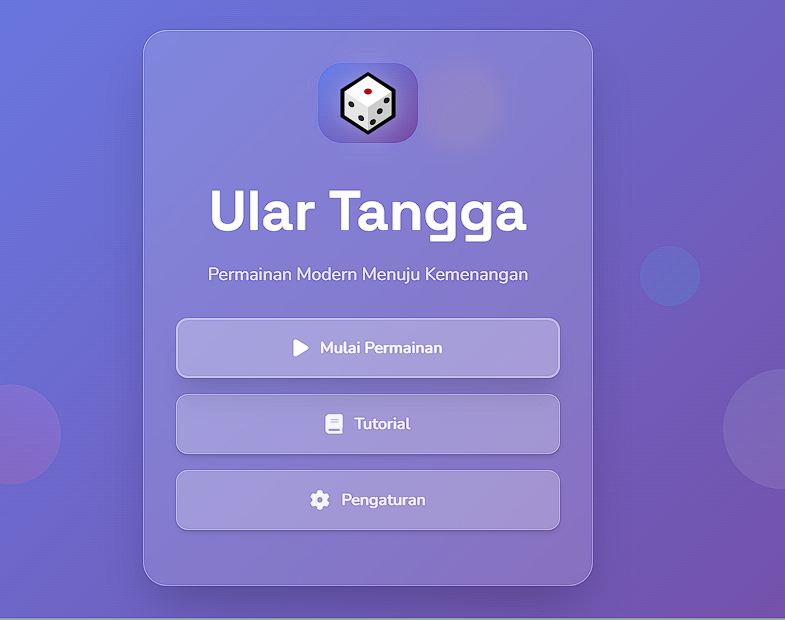

# 🎲 Ular Tangga Modern 🐍

Ini adalah implementasi modern dari permainan klasik Ular Tangga, dibangun dengan HTML, CSS, dan JavaScript. Proyek ini menampilkan papan permainan dinamis, token pemain, AI dasar, dan beberapa mode permainan.

## ✨ Demo Langsung

**[Mainkan gamenya di sini!](https://fawwaz1st.github.io/ulartangga/)**

## 📸 Screenshot

| Tampilan Menu | Tampilan Permainan |
| :---: | :---: |
|  |  |

## 🚀 Fitur

*   **🎲 Papan Permainan Dinamis**: Papan 10x10 yang dibuat secara dinamis dengan JavaScript.
*   **🐍 Ular dan Tangga Acak**: Posisi ular dan tangga dibuat secara acak setiap kali permainan dimulai.
*   **🎨 Token Pemain**: Pemain direpresentasikan oleh token berwarna di papan.
*   **🤖 AI Sederhana**: Bermain melawan lawan AI.
*   **⚡ Mode Permainan**: Pilih antara mode 'Klasik' dan 'Cepat'.
*   **📊 Statistik Permainan**: Melacak jumlah permainan yang dimainkan dan pemenang terakhir.
*   **💻 Antarmuka Pengguna Modern**: Antarmuka yang bersih dan modern dengan modal untuk tutorial dan pengaturan.
*   **📱 Desain Responsif**: Dapat dimainkan di berbagai ukuran layar.

## 🎮 Cara Bermain

1.  Buka **[demo langsung](https://fawwaz1st.github.io/ulartangga/)** atau buka file `index.html` di browser Anda.
2.  Klik tombol "Mulai Permainan" dari menu utama.
3.  Pilih jumlah pemain dan mode permainan di menu pengaturan.
4.  Klik tombol "Lempar Dadu" untuk menggerakkan token Anda.
5.  Pemain pertama yang mencapai kotak 100 adalah pemenangnya! 🏆

## 📂 Struktur Proyek

```
.
├── assets
│   ├── css
│   │   ├── game-styles.css
│   │   ├── loading.css
│   │   ├── menu-styles.css
│   │   └── styles.css
│   ├── images
│   │   ├── favicon.ico
│   │   ├── game.png
│   │   └── menu.png
│   └── js
│       ├── app.js
│       ├── audio.js
│       ├── menu.js
│       └── skills.js
├── views
│   ├── game.html
│   └── menu.html
├── index.html
└── README.md
```

## 🛠️ Teknologi yang Digunakan

*   **HTML5**: Untuk struktur halaman web.
*   **CSS3**: Untuk styling dan animasi.
*   **JavaScript (ES6+)**: Untuk logika permainan dan interaktivitas.

## 🤝 Kontribusi

Kontribusi, isu, dan permintaan fitur dipersilakan! Jangan ragu untuk memeriksa halaman isu.
